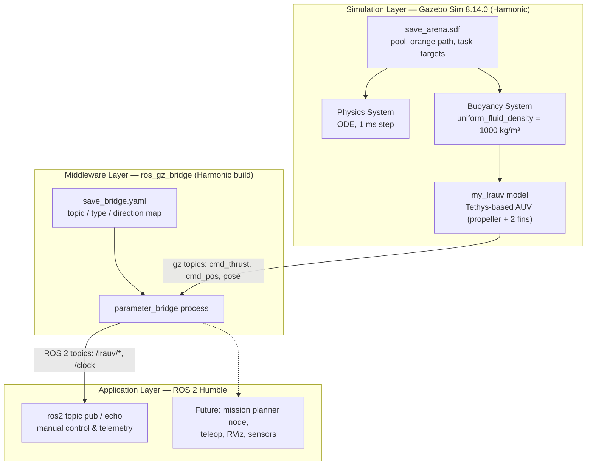

# Software Architecture Report
## NIOT SAVe Arena — Gazebo Simulation & ROS 2 Integration Stack

**Prepared:** July 2026
**Scope:** Simulation environment built for the NIOT Student Autonomous underwater Vehicle (SAVe) competition arena, covering world modeling, vehicle integration, and ROS 2 bridging.

---

## 1. Purpose & Scope

This report documents the software architecture of the simulation stack assembled to model the NIOT SAVe competition arena in Gazebo, spawn a submerged autonomous underwater vehicle (AUV) into it, and expose vehicle control/telemetry to ROS 2 for higher-level autonomy development. It reflects the system **as built and tested** in this session, not a theoretical design — every component listed here was generated, deployed, and debugged against a live Gazebo Sim 8.14.0 (Harmonic) + ROS 2 Humble installation.

---

## 2. System Overview

The stack has three layers: a **simulation layer** (Gazebo world + physics + vehicle), a **middleware/bridge layer** (`ros_gz_bridge`), and an **application layer** (ROS 2 nodes/commands that consume vehicle topics).



---

## 3. Layered Architecture

### 3.1 Simulation Layer — Gazebo Sim 8 (Harmonic)

**World file:** `save_arena.sdf`, generated programmatically (`gen_arena.py`) so every dimension traces back to the NIOT rulebook rather than being hand-eyeballed.

| Element | Implementation |
|---|---|
| Pool | 25 m × 20 m floor, 2.8 m walls, water volume to 2.5 m (visual only) |
| Orange path | Polyline of oriented box segments computed from waypoint coordinates |
| Flowers | 3 spherical floats (9″ / 0.229 m) on posts, red/green/yellow |
| "L"ove Lane | Two pipe segments forming an L, mounted on posts, for gate pass-over |
| Cupid | Red/green split panel target (heart-cutout approximated; true cutout needs a mesh) |
| Path & Bins | Two open-top box bins ("O"/"X") for marker drop task |
| Candy & Delivery | Two regular octagons (2.7 m side, exact circumradius computed via `R = s / (2·sin(π/8))`) with corner floats, for surfacing |

**Physics & Buoyancy:** Because adding *any* `<plugin>` tag to a Gazebo Harmonic world disables its auto-loaded default systems, the world explicitly declares:
- `Physics` (ODE, 1 ms step)
- `UserCommands`
- `SceneBroadcaster`
- `Sensors` (ogre2 render engine)
- `Buoyancy` (uniform fluid density 1000 kg/m³ — applies Archimedes' principle to every link with a collision volume, no per-model opt-in needed)

**Vehicle model:** `my_lrauv` — Gazebo's official tutorial AUV, based on the MBARI Tethys vehicle, with a propeller joint and two fin joints (rudder, elevator). Sourced from the `gz-sim8` tutorial branch rather than hand-built, since it ships with correct hydrodynamic/joint configuration out of the box.

### 3.2 Middleware Layer — `ros_gz_bridge`

Bridges Gazebo transport topics to ROS 2 topics using a declarative YAML config (`save_bridge.yaml`) rather than one-off CLI invocations, so the topic map is versioned and reproducible.

Key design point: **directionality is explicit per topic** (`GZ_TO_ROS`, `ROS_TO_GZ`) — telemetry (clock, pose) flows one way, commands (thrust, fin position) flow the other. This avoids feedback loops and matches how the underlying Gazebo transport topics are actually published.

Because ROS 2 Humble officially targets an older Gazebo release (Fortress), the bridge itself had to be sourced as a non-official Harmonic-compatible build (`ros-humble-ros-gzharmonic` from `packages.osrfoundation.org`), which conflicts with — and must replace — the stock `ros-humble-ros-gz*` packages.

### 3.3 Application Layer — ROS 2 Humble

Currently limited to manual control/inspection via CLI (`ros2 topic pub`, `ros2 topic echo`), standing in for a future autonomy stack. This is the natural extension point for the mission-planning architecture described in the original NIOT document (Section 10.3: Middleware System, AUV Mission Planner, AUV EYE, Intelligent Agent/kernel) — none of that logic has been implemented yet; only the transport layer it would run on top of.

---

## 4. Data Flow / Topic Map

| Direction | Gazebo Topic | ROS 2 Topic | Type | Purpose |
|---|---|---|---|---|
| GZ → ROS | `/clock` | `/clock` | `rosgraph_msgs/msg/Clock` | Sim-time synchronization |
| ROS → GZ | `/model/my_lrauv/joint/propeller_joint/cmd_thrust` | `/lrauv/cmd_thrust` | `std_msgs/msg/Float64` | Forward thrust command |
| ROS → GZ | `/model/my_lrauv/joint/vertical_fins_joint/0/cmd_pos` | `/lrauv/cmd_rudder` | `std_msgs/msg/Float64` | Yaw steering |
| ROS → GZ | `/model/my_lrauv/joint/horizontal_fins_joint/0/cmd_pos` | `/lrauv/cmd_elevator` | `std_msgs/msg/Float64` | Pitch / depth control |
| GZ → ROS | `/model/my_lrauv/pose` | `/lrauv/pose` | `tf2_msgs/msg/TFMessage` | Vehicle localization/telemetry |

---

## 5. File & Directory Structure

```
NIOT shir/
├── save_arena.sdf          # World: pool, orange path, task targets, system plugins
├── save_bridge.yaml        # ros_gz_bridge topic/type/direction map
├── setup_lrauv.sh          # Vehicle downloader (model.sdf, meshes, textures)
├── models/
│   └── my_lrauv/
│       ├── model.config    # Manifest (created manually — see Section 7)
│       ├── model.sdf       # Vehicle definition: hull, propeller, fins
│       ├── meshes/
│       │   ├── tethys.dae
│       │   └── propeller.dae
│       └── materials/textures/
│           ├── Tethys_Albedo.png
│           ├── Tethys_Metalness.png
│           ├── Tethys_Normal.png
│           └── Tethys_Roughness.png
```

---

## 6. Version & Compatibility Matrix

| Component | Version | Notes |
|---|---|---|
| Gazebo Sim | 8.14.0 ("Harmonic") | |
| ROS 2 | Humble (Ubuntu 22.04) | Officially pairs with Gazebo Fortress, not Harmonic |
| Bridge package | `ros-humble-ros-gzharmonic` | Non-official build from `packages.osrfoundation.org`; conflicts with stock `ros-humble-ros-gz*` |
| Physics engine | ODE | 1 ms fixed step |
| Vehicle model | `my_lrauv` (Tethys-based) | Official `gz-sim8` tutorial AUV |
| World format | SDF 1.7 | Compatible with both Gazebo Classic 11 and gz-sim |

---

## 7. Known Issues & Resolutions

A running log of every integration problem hit during setup, since each fix reflects a real constraint of this specific Gazebo/ROS pairing and is likely to recur if the environment is rebuilt from scratch.

| Issue | Root Cause | Resolution |
|---|---|---|
| `gz sim` reported "Unable to find or download file" | Space in folder name (`NIOT shir`) broke shell argument parsing | Quote or escape the path |
| `Unable to find uri[model://ground_plane]` | gz-sim's Fuel-based URI resolver doesn't serve the Gazebo-Classic `model://ground_plane` convention | Removed the `ground_plane` include; the world's own floor box already serves as ground |
| `XML_ERROR_MISMATCHED_ELEMENT` after a `sed` edit | The `sed` deletion removed an opening tag but left its matching closing tag, corrupting XML nesting | Regenerated the file cleanly from the Python generator script rather than patching text in place |
| `Could not find model.config ... in models/my_lrauv` | The download script fetched `model.sdf` + assets but not a manifest | Manually authored `model.config` declaring `model.sdf` as the SDF entry point |
| No way to command the vehicle from ROS 2 | Humble ships no Harmonic-compatible bridge by default | Removed conflicting `ros-humble-ros-gz*`, installed `ros-humble-ros-gzharmonic` |
| `sequence size exceeds remaining buffer` warning + unexpected topics (`/challenge_question`, `/state_estimation`, etc.) appearing in `ros2 topic list` | A separate, unrelated ROS 2 stack was already active on the default `ROS_DOMAIN_ID` (0), and its topics/types were entering our graph during discovery | Isolate the bridge and control terminals on a dedicated `ROS_DOMAIN_ID` (e.g. `42`) |

---

## 8. Known Limitations

- **Water is visual-only.** The `water` model has no collision geometry; all buoyancy/drag physics comes from the world's `Buoyancy` plugin and the vehicle's own hydrodynamic configuration, not from the water mesh itself.
- **Cupid target and bin lettering are primitive approximations.** A true heart-shaped cutout and painted "O"/"X" markings would require mesh assets and textures rather than box/plate primitives.
- **No perception pipeline yet.** The original NIOT document's "AUV EYE" (OpenCV-based image processing against onboard cameras) has no counterpart here — the vehicle has no camera sensor plugin wired up, and no image topics are bridged.
- **No autonomy layer.** Control is manual, one topic at a time, from the CLI. There is no mission planner, state machine, or task sequencer.

---

## 9. Extensibility / Suggested Next Steps

1. **Sensor integration** — add camera/IMU/pressure sensor plugins to `my_lrauv`'s model.sdf and extend `save_bridge.yaml` to carry `sensor_msgs/msg/Image`, `sensor_msgs/msg/Imu`, etc., mirroring the "AUV EYE" and navigation sensors described in the source NIOT document.
2. **Mission planner node** — implement the MVC-style Intelligent Agent architecture from the original document (kernel, AUV Bridge, Mission Task, Logging) as a ROS 2 node that consumes `/lrauv/pose` and sensor topics, and publishes to the existing `cmd_thrust`/`cmd_rudder`/`cmd_elevator` topics to autonomously run the course: dive → touch flower → gate pass → branch (bin drop or torpedo) → surface in octagon.
3. **Visualization** — add a `robot_state_publisher` + TF setup and an RViz2 config for live pose/trajectory viewing alongside Gazebo.
4. **Multi-vehicle** — the world already supports multiple `<include>` blocks; spawning a second `my_lrauv` instance would let two "teams" run the course concurrently, closer to actual competition day.
5. **Domain isolation by default** — bake `ROS_DOMAIN_ID` into a setup script or `.bashrc` export for this project so the cross-talk issue from Section 7 doesn't resurface.

---

## 10. References

- NIOT, "A success story of Indian National Student Autonomous underwater Vehicle Competition (2011–2017)," National Institute of Ocean Technology, Chennai, Ministry of Earth Sciences, 31 Aug 2018. (Source document for arena dimensions, task geometry, and mission-planner architecture referenced throughout.)
- Gazebo Sim documentation, "Installing Gazebo with ROS" — `gazebosim.org/docs/harmonic/ros_installation`
- Gazebo Sim documentation, "Underwater Vehicles" tutorial (`my_lrauv` model source) — `gazebosim.org/api/sim/8/underwater_vehicles.html`
